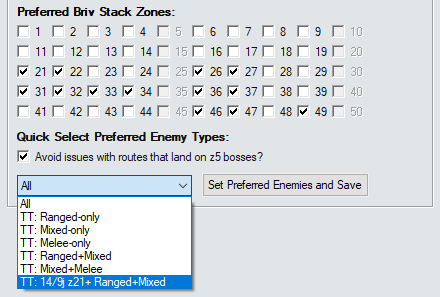

# Hybrid Turbo Stacking - Preferred Enemies

This is just a very simple addon that will let you quick select the `Preferred Briv Stack Zones` from a dropdown box.

> [!NOTE]
> *z33 is always turned off regardless of the option you choose because it is a truly terrible zone to try to stack on. The Gazers can attack every champion in the formation - meaning Briv gets stacks extremely slowly.*